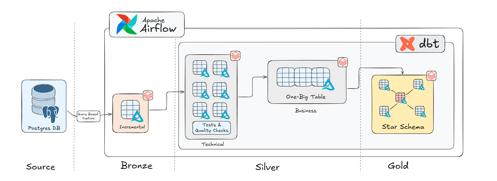
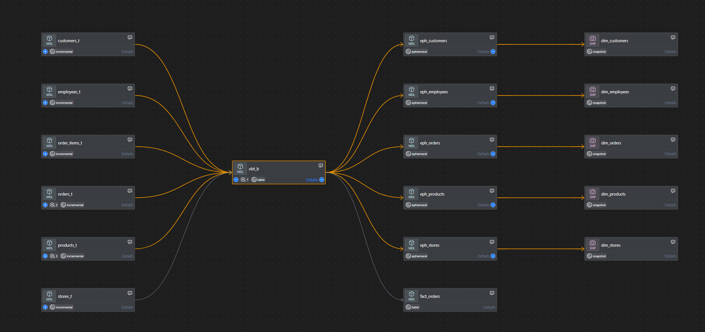
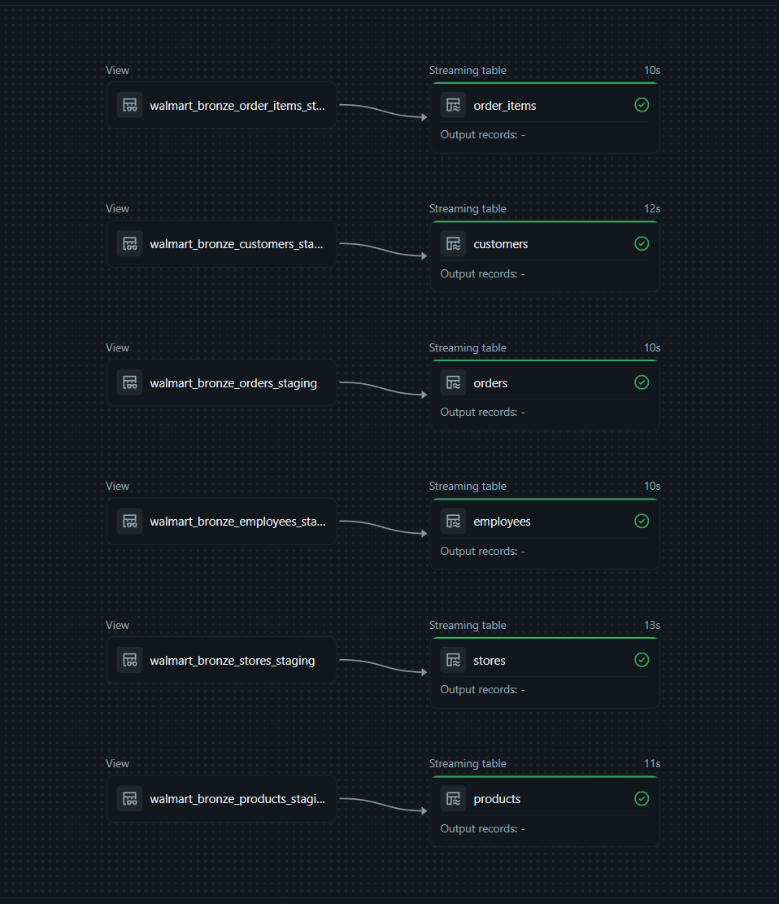
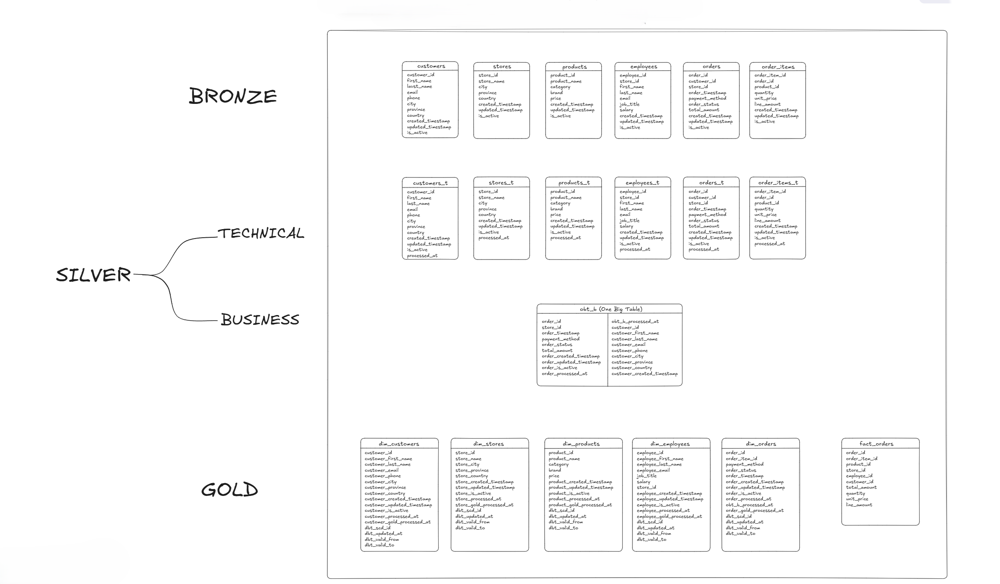
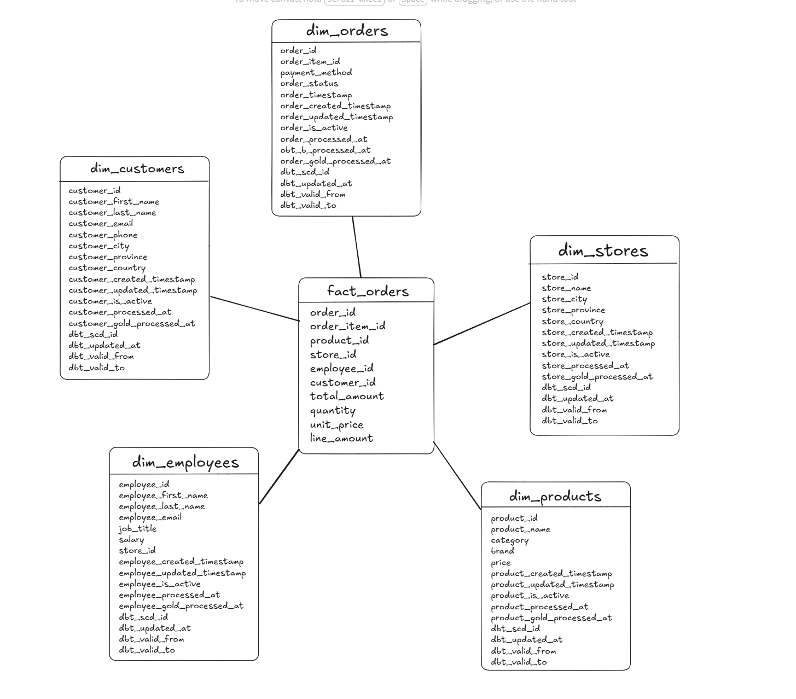
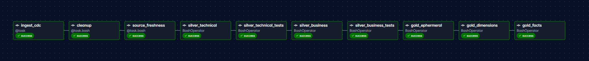

# Walmart Retail Operations Pipeline
An end-to-end data engineering pipeline implementing a Medallion architecture to process enterprise retail operations data. This project extracts multi-domain data including data about customers, employees, products, orders, order items and stores — from a PostgreSQL database into Bronze layer, transforms it through clearly defined Silver and Gold layers using dbt, and orchestrates the entire workflow with Apache Airflow using Docker Containers.
<br><br>
## Architecture & Data Flow


Data flows through three distinct stages:
1. **Bronze (Ingestion Layer):** Raw data is extracted from PostgreSQL.
2. **Silver (Processing Layer):** Split into two distinct phases:
   * **Technical:** Cleanses, deduplicates, and standardizes initial data types across 6 core entities.
   * **Business:** Integrates the cleansed entities into a unified 'One-Big Table' view representing core business logic.
3. **Gold (Reporting Layer):** Generates final dimensional models using dbt ephemeral tables and snapshots for slowly changing dimensions, alongside standard fact tables.
<br><br>

## Tech Stack
* **Orchestration:** Apache Airflow
* **Transformation:** dbt (Data Build Tool)
* **Processing Engine:** Databricks
* **Database:** PostgreSQL (Using neon.tech)
* **Languages:** Python, SQL
<br><br>

## Repository Structure
The following directories are listed in the chronological order of their development:
* **`/data_ingestion`**<br>
  Contains the Python scripts using `psycopg2` to establish the initial PostgreSQL database source and load the raw retail dataset.
* **`/dbt`**<br>
  Houses the dbt project containing the Medallion architecture logic. Includes custom macros for data testing, logic for materializing different layers of tables, ephemeral table and dimensional snapshots (which creates SCD Type 2 tables).
  Final Output data is in form of Star Schema containing 4 dimension and 1 fact table.
* **`/airflow`**<br>
  Contains the DAGs that schedule and orchestrate the pipeline (currently scheduled daily at 11:00 AM IST). 
<br><br>

## Data Lineage


The pipeline relies on structured dbt techniques to track data movement and ensure integrity:
* **Pipeline Traceability:** Data flows predictably from Bronze raw tables through intermediate Silver views, terminating in the Gold presentation layer, allowing for clear auditing of every transformation step.
* **Data Quality:** Primary key integrity checks and custom macros are enforced at the Silver layer before data is permitted to move downstream.
<br><br>

## Data Ingestion


To initially populate the Bronze layer, the pipeline utilizes the native **Databricks Data Ingestion** tool to pull from the serverless PostgreSQL database. 

Instead of performing slow, full-table reloads, it uses Databricks streaming tables to incrementally stream new data from PostgreSQL directly into the Bronze layer. This query-based capture guarantees an efficient, 1:1 replication of the raw source data into the Databricks environment before any dbt transformations begin.


## Data Modeling Strategy


The modeling strategy follows the Medallion architecture:
* **Bronze Layer:** Acts as the initial ingestion point, maintaining raw 1:1 copies of the 6 core source tables (customers, stores, products, employees, orders, order_items).
* **Silver Layer:** The raw tables are first cleansed and standardized in the Silver Technical layer. They are then merged into a unified 'One-Big Table' (`obt_b`) in the Business Silver layer to pre-calculate and avoid repetitive complex joins.
* **Gold Layer (Star Schema):** The flattened data is restructured into a presentation-ready Star Schema based on Context. It is optimized for analytical querying, separating business context into dimensions and measurable metrics into facts. 

The following image shows the output Gold schema:



The final Gold layer relies on specific dbt features to track historical changes and optimize performance:
* **Dimensions:** Tables like `dim_products` and `dim_stores` store descriptive attributes. Snapshots are implemented here to build Type 2 Slowly Changing Dimensions (SCDs),  tracking historical states of records via `dbt_valid_from` and `dbt_valid_to` columns.
* **Facts:** The `fact_orders` table serves as the numerical core, holding calculated measures (e.g., `total_amount`, `quantity`) alongside the foreign keys needed to slice those numbers by the surrounding dimensions.
* **Ephemeral Tables:** Used to optimize intermediate queries during this modeling phase without materializing unnecessary tables in the warehouse.


## Orchestration


Apache Airflow serves as the central orchestrator for the project, managing the end-to-end execution of the pipeline. 

Key functions include:
* **Dependency Management:** Enforces strict execution order, ensuring data ingestion for all 6 source tables completes successfully before any downstream models run.
* **Automated Transformations:** Triggers Databricks compute to execute the dbt transformation sequence across the Silver and Gold layers.

# Setup Guide

## 1. Virtual Environment Setup 
Each folder contains its own virtual environment setup using `uv` instead of `pip` but can be installed using `pip install uv`.<br>
The dbt virtual environment does not need to be set up since it is bind-mounted to the Airflow container and can be run from Airflow. (Required for development)<br>
The following command sets up the `.venv` in their respective directories:
```bash
uv sync
```

## 2. Environment variables & Secrets
This project requires secrets to be filled in 3 files for running.<br>
`/airflow` and `/ingestion` each contain `.env_clone` files. Rename them to `.env` and fill in the details.<br>
`/dbt` contains `profiles_clone.yml`. Rename it to `profiles.yml` and fill in the compute credentials to connect with the compute.
<br>

## 3. Setting up PostgreSql Database for Source
Navigate to `/data_ingestion`, create .venv, and execute the setup script to load the raw tables.<br>
*WORKS WITH ANY POSTGRESQL DB.* 
```bash
python ddl/initialize_db.py
```

## 4. Start Airflow: 
Navigate to `/airflow` and start the local environment.
```bash
docker-compose up -d
```

## 5. Trigger the Pipeline
Access the Airflow UI at `localhost:8080` and unpause the DAG to execute the full extraction and transformation process.
User and Password for login are set to defaults, which are : 'airflow'

